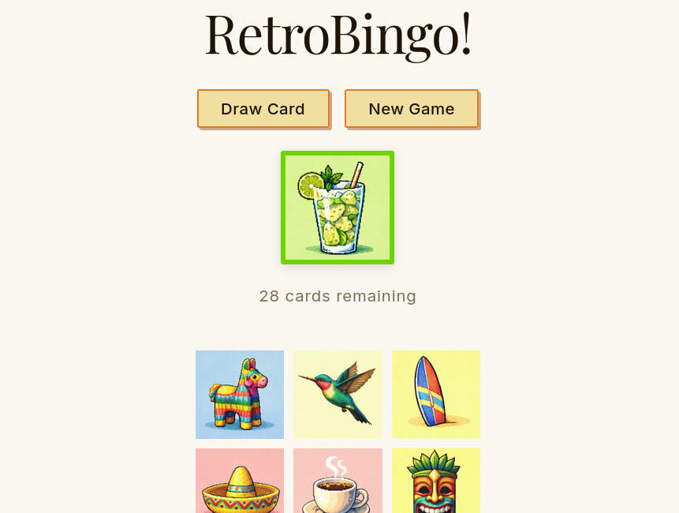

# RetroBingo



A retro-themed bingo game built with React and TypeScript.

## How to play

[Play it here](https://solargc.github.io/retrobingo/)

1. Click **Draw Card** to reveal an icon from the deck
2. If the icon appears on your 3×3 board, click it to mark it
3. Complete a row, column, or diagonal to win
4. Click **New Game** to reset at any time

## Goal

A learning project to go from zero to a deployed web app.
Vite/React/TypeScript setup, components and state, Fisher-Yates shuffle, modern responsive CSS, and static site deployment.

## Run locally

```bash
npm install
npm run dev
```

Built with [Vite](https://vite.dev), React, and TypeScript.

## Notes

Images are AI-generated, with a nostalgic Caribbean aesthetic.
Claude Code for boilerplate, CSS tinkering, syntax learning.
